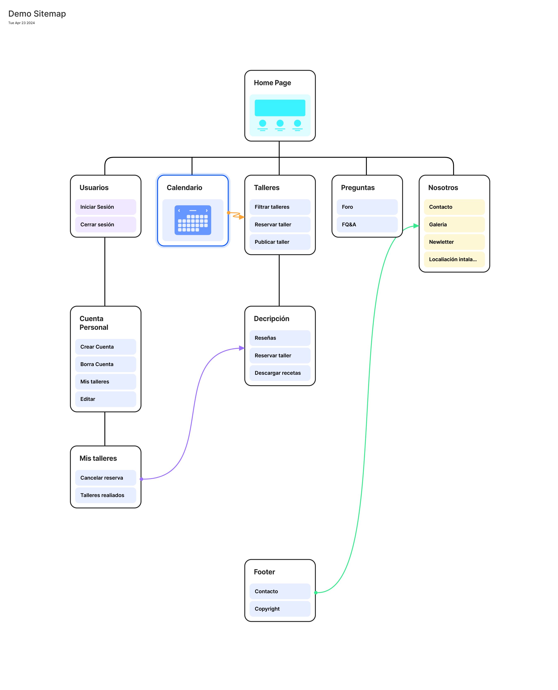

## DIU - Practica2, entregables

### Ideación 
* Mapa de empatía

### PROPUESTA DE VALOR
AÑADIR DESCRIPCION DE LA PROPUESTA
* ScopeCanvas

### TASK ANALYSIS
* User Task Matrix 
* User/Task flow

### ARQUITECTURA DE INFORMACIÓN
* Sitemap 
* Labelling 

### Prototipo Lo-FI Wireframe 

### Conclusiones  
(incluye valoración de esta etapa)

------------------------ SKELETON ----------------------

>>> Comenta con un diagrama los aspectos más destacados a modo de conclusion de la práctica anterior,
>>> 

 Interesante | Críticas     
| ------------- | -------
  Preguntas | Nuevas ideas
  
    
>>> ¿Que planteas como "propuesta de valor" para un nuevo diseño de aplicación para economia colaborativa ?
>>> Problema e hipótesis
>>>  Que planteas como "propuesta de valor" para un nuevo diseño de aplicación para economia colaborativa te
>>> (150-200 caracteres)

 2.b ScopeCanvas
----
>>> Propuesta de valor
>>> 

 2.b User Flow (task) analysis 
-----

>>> Definir "User Map" y "Task Flow" ...
>>> 

 2.c IA: Sitemap + Labelling 
----

>>> Identificar términos para diálogo con usuario  

Término | Significado     
| ------------- | -------
  Login¿?  | acceder a plataforma

 2.d Wireframes
-----

>>> Plantear el  diseño del layout para Web/movil (organización y simulación ) 

