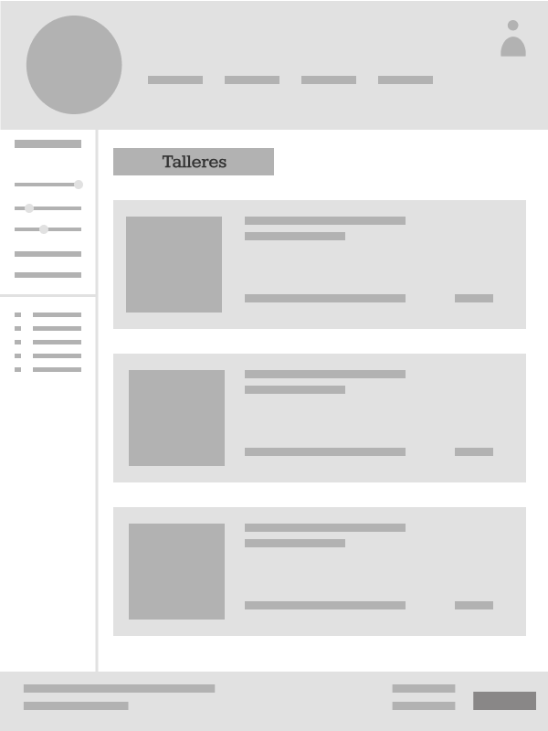
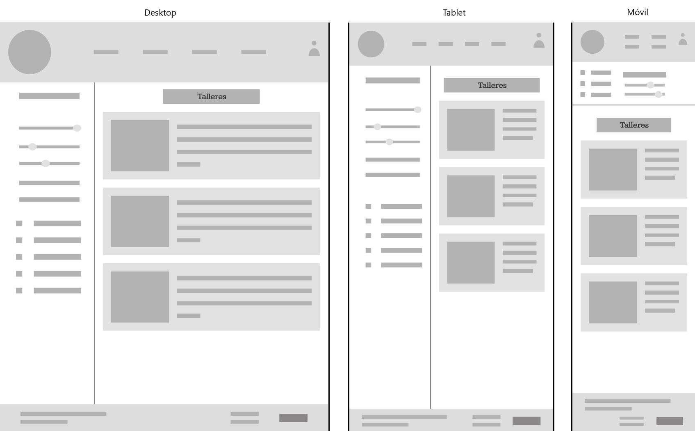

## DIU - Practica2

### 1. Ideación (Empathy Map)
Hemos realizado un mapa de empatía, en el que recabamos el comportamiento de los usuarios de la práctica 1 (y además nuestra propia experiencia) para así abordar el diseño.

### 2. Propuesta de valor (Scope Canvas)
"Descubre la esencia auténtica de la gastronomía regional española además de los tesoros culinarios autóctonos de las distintas zonas regionales de todo el mundo con nuestra plataforma de cursos online. Explora desde los clásicos hasta los platos de nicho, ofreciendo una experiencia única que revela la diversidad de la cocina tradicional española y de las gastronomías locales de distintos países, desconocidas para muchos".

Nuestra plataforma se centra en la gastronomía española y en la cocina local de distintos lugares del mundo, es decir, no los platos típicos sino distintas experiencias poco habituales, dando valor añadido a nuestra propuesta en comparación a la competencia.

### 3. Task Analysis
Presentamos el Task Analysis en el que identificamos las tareas principales y su relevancia para los distintos usuarios que hemos identificado; no registrados, registrados y usuarios VIP. En primer lugar enumeramos las tareas en la tabla e indicando su relevancia (- nula, 1 Baja, 2 media, 3 alta). A continuación reflejamos las tres más importantes en los User Flow, que muestran de forma visual la acciones que hay que llevar a cabo para realizar una actividad/tarea, y muestra las relaciones y las dependencias entre las mismas.

#### 3.1. Task Matrix

#### 3.2. User Flow

### 4. ARQUITECTURA DE INFORMACIÓN
Proponemos una organización lógica de la navegación y elementos de diseño. En este paso, presentamos el sitemap junto con el etiquetado (labelling) del sitio:

#### 4.1. Sitemap

#### 4.2. Labelling

### 5. Prototipo Lo-FI Wireframe 
Los diseños se han realizado en tres partes. La primera ha sido una primera idea o sketch realizado a mano. La segunda es un diseño preliminar en Figma. La última es el diseño preparado para diferentes formatos de pantallas, hecho en Figama haciendo uso del plugin Breakpoints. Hemos hecho layouts para PC, tablet y móvil.

#### 5.1. Esbozos a papel

 

#### 5.2. Wireframes preliminares en Figma

#### 5.3. Diseños Responsive en Figma (usando Breakpoints)

*Ver vídeo adjunto que muestra el comportamiento responsive de los layouts:* [Video layouts responsive](5_3_VideoResponsive.webm)

### 6. Conclusiones  
En esta práctica hemos analizado las desventajas que nuestras personas y nosotros mismos habíamos encontrado en las páginas web analizadas en la práctica anterior. Esto nos ha permitido obtener diversas nociones sobre los diseños que serían apropiados para nuestra página. Además hemos realizado nuestra propuesta de valor que nos permitirá aportar mayor valor a nuestra comunidad de usuarios que se verá incrementada efectivamente. Finalizamos la práctica obteniendo nuestros diseños adaptativos a distintos formatos de pantalla, hecho que es de gran utilidad teniendo en cuenta que en la actualidad gran parte de la comunidad accede a las plataformas web desde el móvil.
