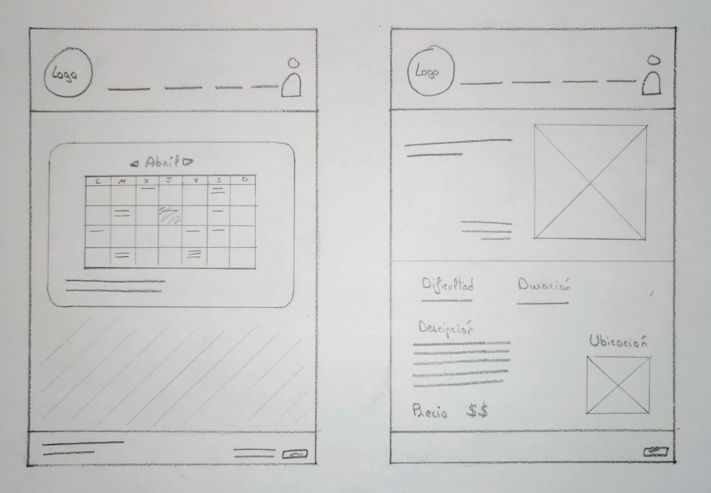

## DIU - Practica2, entregables

### 1. Ideación 
* Hemos realizado un mapa de empatía, en el que recabamos el comportamiento de los usuarios de la práctica 1 (y además nuestra propia experiencia) para así abordar el diseño.
>>> 

### 2. PROPUESTA DE VALOR
"Descubre la esencia auténtica de la gastronomía regional española con nuestra aplicación. Explora desde los clásicos hasta los tesoros culinarios autóctonos de nicho como calçots y paparajotes, ofreciendo una experiencia única que revela la diversidad de la cocina tradicional española, desconocida para muchos."
>>> AÑADIR DESCRIPCION DE LA PROPUESTA

  2.b ScopeCanvas
>>> 

### 3. TASK ANALYSIS
* Presentamos el Task Analysis en el que identificamos las tareas principales y su relevancia para los distintos usuarios que hemos identficado; no registrados, registrados y usuarios VIP. En primer lugar enumeramos las tareas en la tabla e indicando su relevancia (- nula, 1 Baja, 2 media, 3 alta). A continuación reflejamos las tres mas importantes en unos User Flow, que muestran de forma visual la acciones que hay que llevar a cabo para realizar una actividad/tarea, y muestra las relaciones y las dependencias entre las mismas.
>>> 
>>> 

### 4. ARQUITECTURA DE INFORMACIÓN
* Proponemos una organización lógica de la navegación y elementos de diseño. En este paso, presentamos el sitemap junto con el etiquetado (labelling) del sitio.
  2.c Sitemap
>>> 
  2.d Labelling 
>>> 

### 5. Prototipo Lo-FI Wireframe 
 2.d Wireframes

Bocetos Lo-Fi PARA WEB de las distintas pantallas del interfaz (las más relevantes). Un primer esbozo en PAPEL.
>>>
>>> 
>>>  

Wireframe preliminar en FIGMA.
>>>
Diseño RESPONSIVE (para ver su comportamiento en distintos dispositivos) usando plugin Breakpoint

### 6. Conclusiones  
(incluye valoración de esta etapa)

------------------------ SKELETON ----------------------

>>> Definir "User Map" y "Task Flow" ...

>>> Identificar términos para diálogo con usuario  

Término | Significado     
| ------------- | -------
  Login¿?  | acceder a plataforma

-----

>>> Plantear el  diseño del layout para Web/movil (organización y simulación ) 

