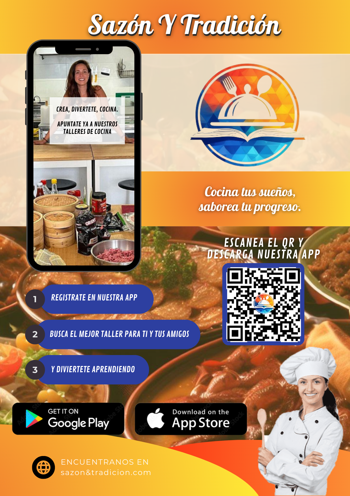

# DIU - Practica 3, entregables

## Moodboard (diseño visual + logotipo)   
Presentamos nuestro moodboard, en el que detallamos la guía de estilos visual de nuestra app. Dentro de la imagen se encuentran los detalles de porque la elección de cada componente, tanto para logo, tipografia, paleta de colores, etc.

## Landing Page
Nuestro Landing Page ya con el estilo de diseño visual seleccionado.

## Mockup: LAYOUT HI-FI

## Documentación: Publicación del Case Study

(incluye) Valoración del equipo sobre la realización de esta práctica o los problemas surgidos
 
