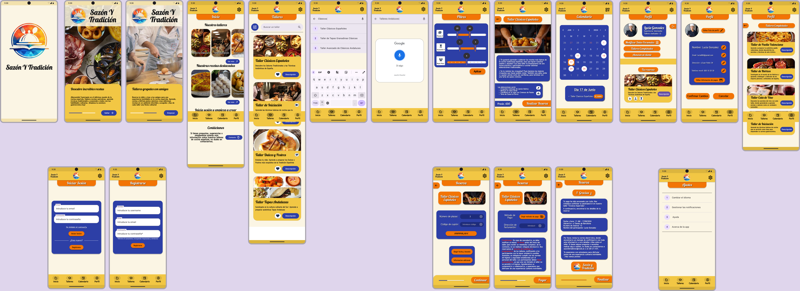

# DIU - Practica 3

## Moodboard (diseño visual + logotipo)  
Presentamos nuestro moodboard, en el que detallamos la guía de estilos visual de nuestra app. Dentro de la imagen se encuentran los detalles de porque la elección de cada componente, tanto para logo, tipografia, paleta de colores, etc.

## Landing Page   
Nuestro Landing Page ya con el estilo de diseño visual seleccionado. Ya que el objetivo principal de una landing page es convertir a los espectadores del mismo en clientes potenciales o reales hemos definido su diseño en base a los siguientes puntos:
- Nombre y logo presentes, presentados al inicio y claramente distinguibles.
- Señalar claramente que es una aplicación y como obtenerla/descargarla.
- Ciertos motivos para usarla, "beneficios".
- Que quede claro el objetivo de nuestra app el tema, y para que es.

Con los puntos anteriores creemos que tenemos un landing page atrativo y claro con un mensaje directo.

## Mockup: LAYOUT HI-FI  
Finalmente, con todo lo anterior, definimos nuestro prototipo final, en el cual aplicamos todo lo visto, con nuestro propio estilo y diseños definidos anteriormente.

Enlace a un video mostrando el prototipo en Figma, navegando por las distintas paginas y mostrando los diseños creados:

Enlace a el prototipo en Figma: https://www.figma.com/design/65QxXD3yth2ZTdxlKzZeAq/LAYOUT-HI-FI-SAZON-Y-TRADICION?node-id=54795%3A26436&t=3vvPNdoDBFbmm0Pm-1

## Valoración del equipo sobre la realización de esta práctica o los problemas surgidos
 
