# DIU24
Prácticas Diseño Interfaces de Usuario 2023-24 (Tema: Experiencias gastronómicas ) 

Grupo: DIU2.Alcaparra.  Curso: 2023/24 
Updated: 17/03/2024

Proyecto: Web Experiencias Gastronómicas

Descripción:

Nuestro proyecto consiste en una web/aplicación sobre Experiencias gastronómicas, en concreto nuestra APP Sazón y Tradición es un proyecto destinado al servicio de talleres sobre cocina española y local, con el objetivo de ofrecer una experiencia completa a nuestros visitantes. Nuestra propuesta consiste en una web o app que permite a los usuarios registrarse y llevar un control de sus talleres realizados, sus reservas y otra información, permitimos una subscripción VIP con ciertos beneficios, y otras distintas funcionalidades. Para ello proponemos un diseño fácil de navegar y lo mas intuitivo posible, con una estructura clara y organizada dividida en secciones, para facilitar la lectura y comprensión de la información.
Logotipo: 

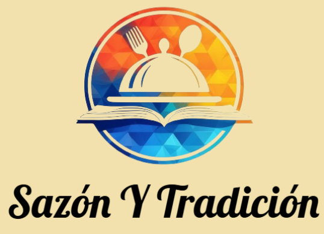

Miembros
 * :bust_in_silhouette:   Álvaro López Vergara     :octocat:     
 * :bust_in_silhouette:  David Ortega Sillero     :octocat:

----- 

# Proceso de Diseño 

## Paso 1. UX User & Desk Research & Analisis 

 **1.a User Reseach Plan**
-----

>>> Hemos rellenado la plantilla de User Research para poder mejorar el desarrollo de nuestra página web. Este documento recopila información, análisis de preferencias de usuarios, así como los objetivos generales que pretendemos potenciar.
>>> [User Research PDF](P1/1.UserResearch/UserResearch_Alcaparra.pdf).

 1.b Competitive Analysis
-----

>>> Hemos realizado el analisis de 3 paginas diferente, las dos que visitan nuestras personas y una tercera que pensamos que mejora en gran medida, varios de los aspectos, con respecto a las dos primeras, tanto a nivel funcional, estético, entre otro. Estos puntos son los que creemos más relevantes para una pagina web y en concreto de experiencias y aprendiaje gastronómico.
>>> 

 1.c Persona
-----

>>> Hemos seleccionado estas dos personas, un historiador y profesor de instituto de Logroño, y una ingeniera ambiental de valencia, ambos con su propio y diferente trasnfondo personal. Pensamos que los dos buscan entrar en un nuevo ambito como es la gastronomía y que debido a sus diferencias, buscaran distintas cosas dentro de este mismo objetivo.
>>> 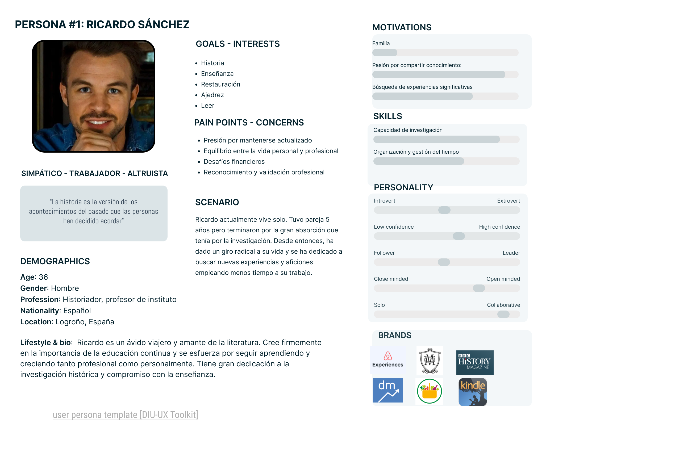
>>> 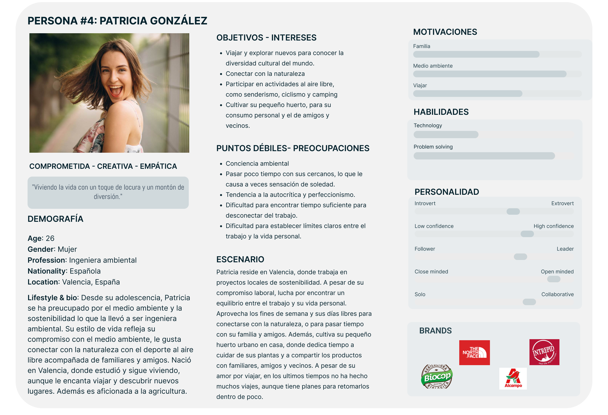

 1.d User Journey Map
----

>>> Presentamos dos experiencias de usuario distintas según las caracteristicas de nuestras personas. Que aunque puedan parecer inusuales, creemos que son bastante fieles a la personalidad y espectativas ee cada uno.
>>> 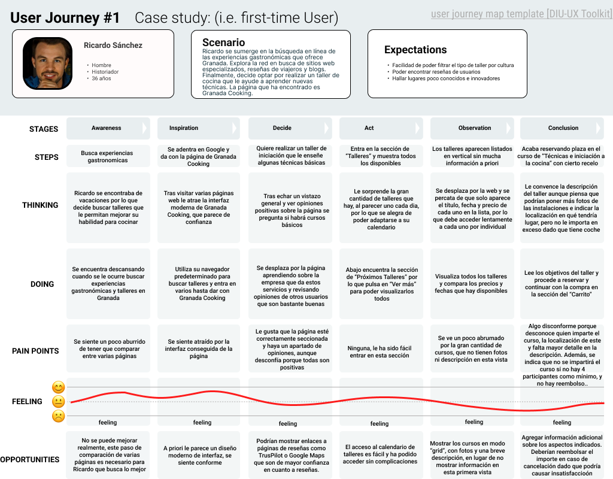
>>> 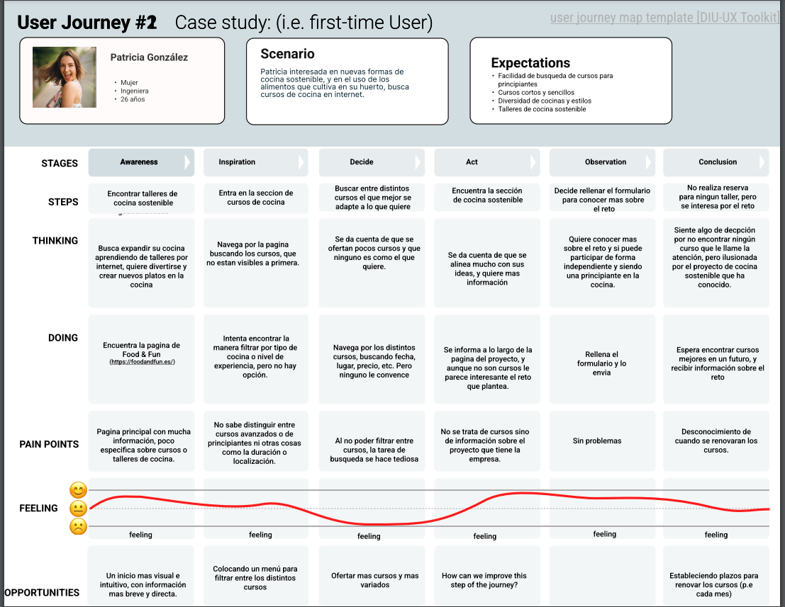

 1.e Usability Review
----

>>> - Enlace al documento: [Usability Review PDF](P1/5.UsabilityReview/UsabilityReview.pdf).
>>> - Valoración final (numérica): 66 - Moderate
>>> - Comentario sobre la valoración: La página de Granada Cooking ha obtenido una puntuación de 66 en nuestro Usability Review. En general la web está correctamente seccionada con apartados concisos e informativos. Dispone de un menú superior que permite acceder a los apartados principales como son la sección de talleres. No obstante, se han hallado una serie de fallos críticos que empeoran la experiencia de usuario final como son:
>>> 
>>>     -- Tiempo de carga de la sección de _talleres_ extremadamente lenta.
>>> 
>>>     -- En la página principal solo se muestran talleres ya expirados, haciendo imposible su reserva.
>>> 
>>>     -- Dificultad para guardar un curso en el carrito, puede mostrar un mensaje de error extraño si no se hace correctamente.
>>> 
>>>     En conclusión la página web es minimalista y cumple con su función aunque tiene diversos apartados a mejorar.

## Paso 2. UX Design  

 2.a Reframing / IDEACION: Feedback Capture Grid / EMpathy map 
----

### 1. IDEACION (Empathy Map)
Hemos realizado un mapa de empatía, en el que recabamos el comportamiento de los usuarios de la práctica 1 (y además nuestra propia experiencia) para así abordar el diseño.

### 2. Propuesta de valor (Scope Canvas)
"Descubre la esencia auténtica de la gastronomía regional española además de los tesoros culinarios autóctonos de las distintas zonas regionales de todo el mundo con nuestra plataforma de cursos online. Explora desde los clásicos hasta los platos de nicho, ofreciendo una experiencia única que revela la diversidad de la cocina tradicional española y de las gastronomías locales de distintos países, desconocidas para muchos".

Nuestra plataforma se centra en la gastronomía española y en la cocina local de distintos lugares del mundo, es decir, no los platos típicos sino distintas experiencias poco habituales, dando valor añadido a nuestra propuesta en comparación a la competencia.

### 3. Task Analysis
Presentamos el Task Analysis en el que identificamos las tareas principales y su relevancia para los distintos usuarios que hemos identificado; no registrados, registrados y usuarios VIP. En primer lugar enumeramos las tareas en la tabla e indicando su relevancia (- nula, 1 Baja, 2 media, 3 alta). A continuación reflejamos las tres más importantes en los User Flow, que muestran de forma visual la acciones que hay que llevar a cabo para realizar una actividad/tarea, y muestra las relaciones y las dependencias entre las mismas.

#### 3.1. Task Matrix
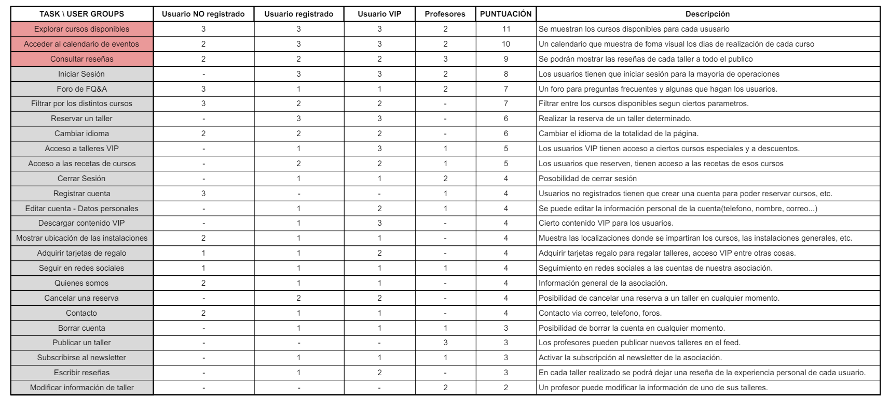
#### 3.2. User Flow
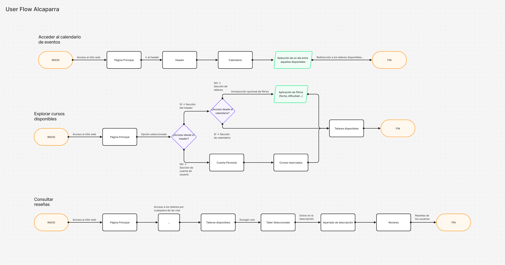

### 4. ARQUITECTURA DE INFORMACIÓN
Proponemos una organización lógica de la navegación y elementos de diseño. En este paso, presentamos el sitemap junto con el etiquetado (labelling) del sitio:

#### 4.1. Sitemap
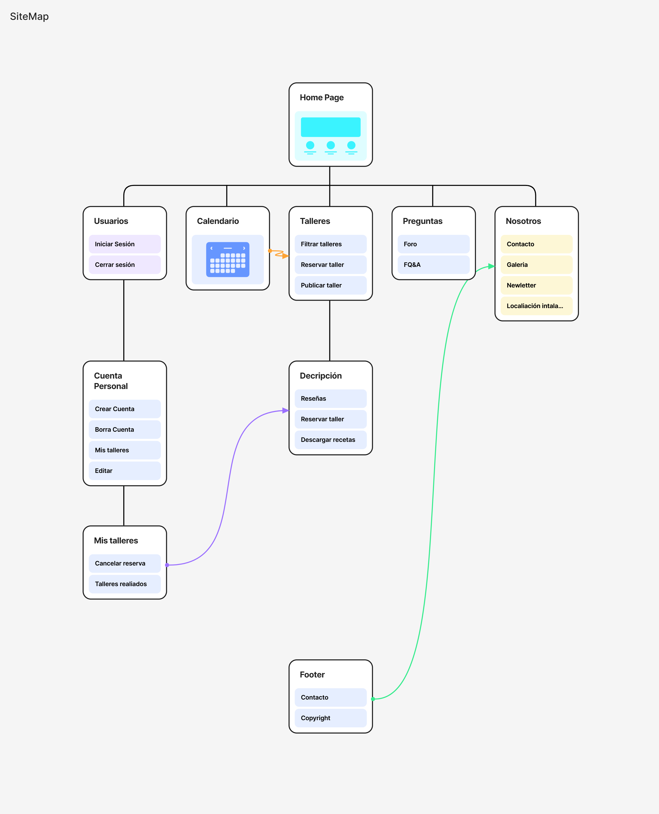
#### 4.2. Labelling
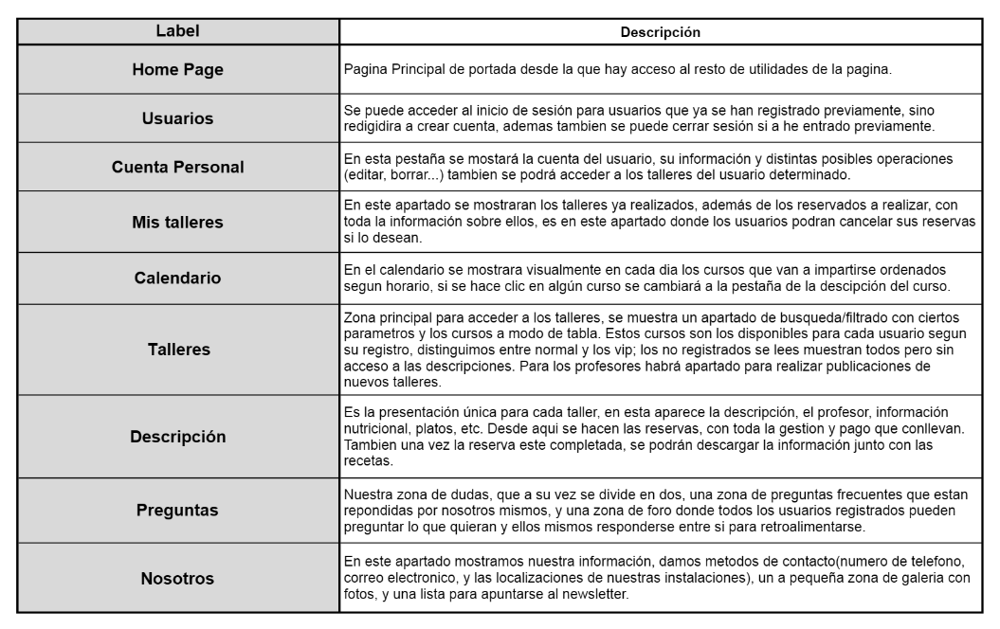

### 5. Prototipo Lo-FI Wireframe 
Los diseños se han realizado en tres partes. La primera ha sido una primera idea o sketch realizado a mano. La segunda es un diseño preliminar en Figma. La última es el diseño preparado para diferentes formatos de pantallas, hecho en Figama haciendo uso del plugin Breakpoints. Hemos hecho layouts para PC, tablet y móvil.

#### 5.1. Esbozos a papel

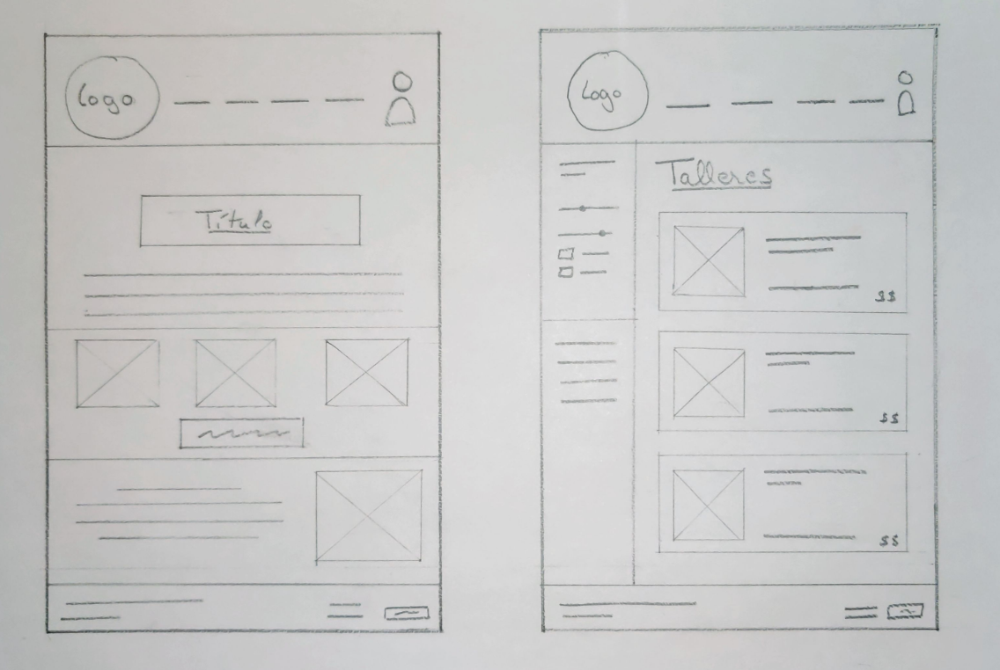
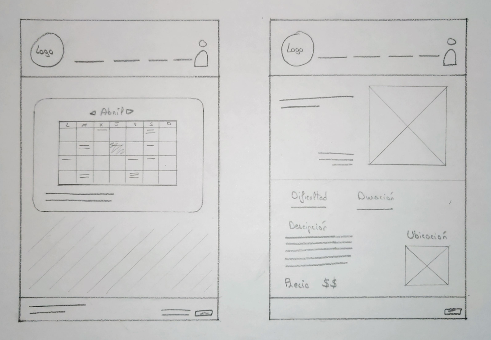 

#### 5.2. Wireframes preliminares en Figma

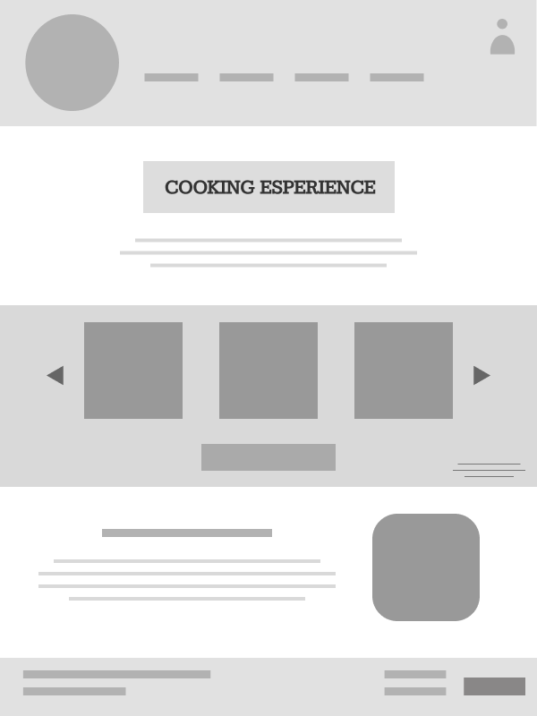
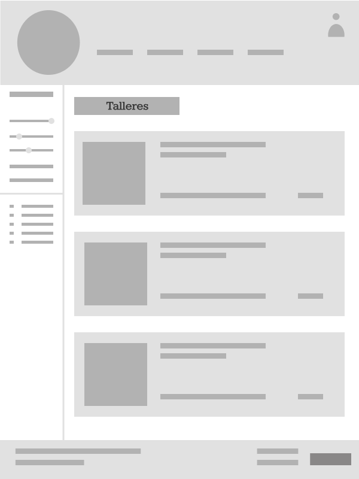
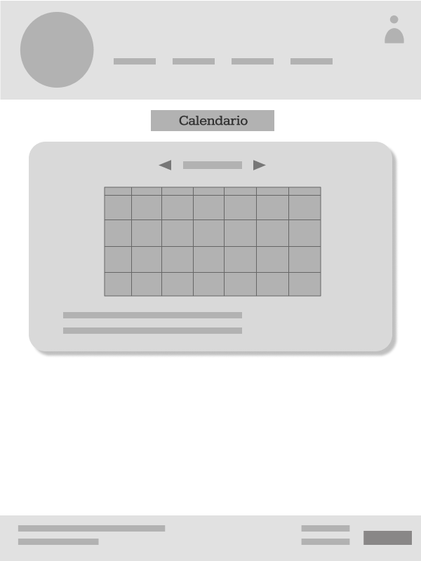
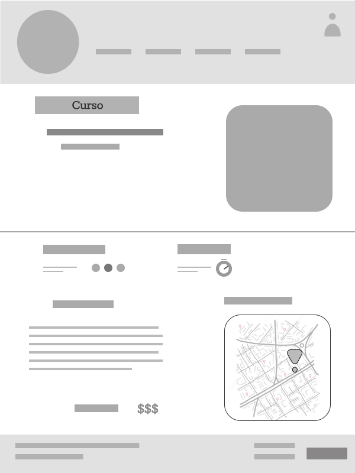

#### 5.3. Diseños Responsive en Figma (usando Breakpoints)

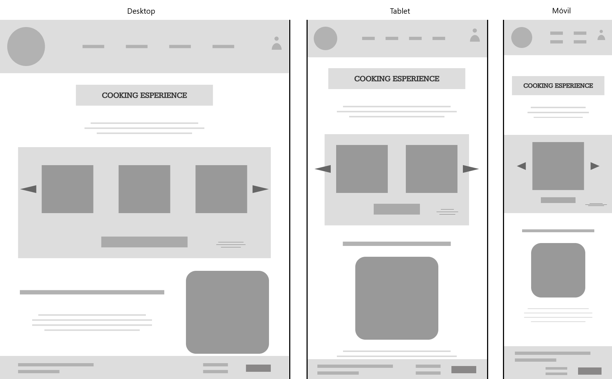
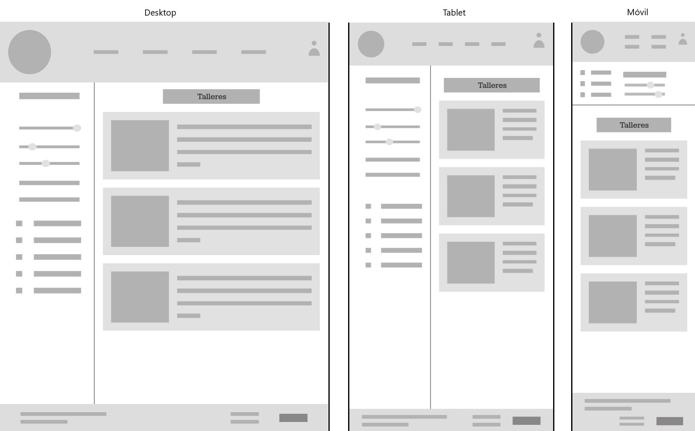

*Ver vídeo adjunto que muestra el comportamiento responsive de los layouts:* [Video layouts responsive](P2/5_3_VideoResponsive.webm)

### 6. Conclusiones  
En esta práctica hemos analizado las desventajas que nuestras personas y nosotros mismos habíamos encontrado en las páginas web analizadas en la práctica anterior. Esto nos ha permitido obtener diversas nociones sobre los diseños que serían apropiados para nuestra página. Además hemos realizado nuestra propuesta de valor que nos permitirá aportar mayor valor a nuestra comunidad de usuarios que se verá incrementada efectivamente. Finalizamos la práctica obteniendo nuestros diseños adaptativos a distintos formatos de pantalla, hecho que es de gran utilidad teniendo en cuenta que en la actualidad gran parte de la comunidad accede a las plataformas web desde el móvil.

## Paso 3. Mi UX-Case Study (diseño)

## Moodboard (diseño visual + logotipo)  
Presentamos nuestro moodboard, en el que detallamos la guía de estilos visual de nuestra app. Dentro de la imagen se encuentran los detalles y justificación de la elección de cada componente, tanto para logo, tipografia, paleta de colores, etc.

## Landing Page
Nuestro Landing Page emplea el estilo de diseño visual seleccionado. Ya que el objetivo principal de una landing page es convertir a los espectadores del mismo en clientes potenciales o reales hemos definido su diseño en base a los siguientes puntos:
- Nombre y logo presentes, presentados al inicio y claramente distinguibles.
- Señalar claramente que es una aplicación y como obtenerla/descargarla.
- Ciertos motivos para usarla, "beneficios".
- Que quede claro el objetivo de nuestra app el tema, y para que es.

Con los puntos anteriores creemos que tenemos un landing page atrativo y claro con un mensaje directo.

## Guidelines
La información sobre los patrones de diseño se ha extraído de [Material3](https://m3.material.io/components). En el pdf que presentamos a continuación explicamos los patrones usados y aduntamos imagenes de los componentes que hemos diseñado para llevar a cabo estos. Toda la información se encuenta aqui: [Guidelines](P3/PatronesDiseñoGuidelines.pdf)

## Mockup: LAYOUT HI-FI 
Finalmente, con todo lo anterior, definimos nuestro prototipo final, en el cual aplicamos todo lo visto, con nuestro propio estilo y diseños definidos anteriormente.

Enlace a un video mostrando el prototipo en Figma, navegando por las distintas paginas y mostrando los diseños creados: [Video_HIFI](P3/Video_Layout_HIFI.mp4)

Enlace a el prototipo en Figma: [DISEÑO HI-FI
](https://www.figma.com/design/96KRfwwCpYM1H7CoXUal2D/DIU2.Alcaparra---Saz%C3%B3n-Y-Tradici%C3%B3n?node-id=54795%3A26436&t=U6ndjTxXUq5liRxb-1)
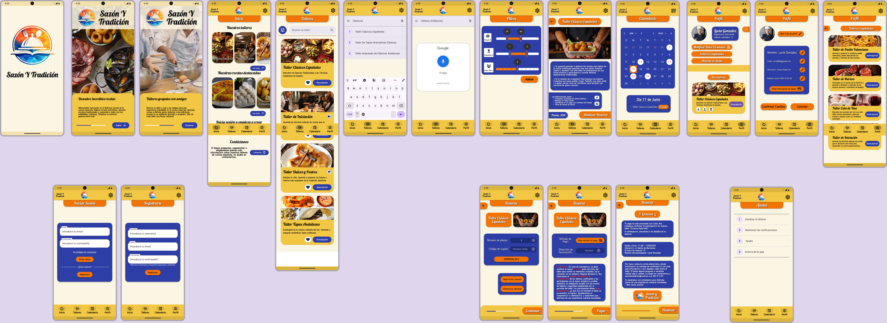

## Valoración del equipo sobre la realización de esta práctica o los problemas surgidos
En el proceso de diseño, hemos creado un prototipo de app realista utilizando Figma. Este mokup HI-FI ha sido clave para definir y perfeccionar el diseño de la aplicación, así como las transiciones entre las distintas secciones y pantallas.

Al usar los componentes de diseño y las guías de Material M3 de Google, hemos reutilizado muchos componentes, lo que nos ha facilitado el diseño y ha garantizado que la aplicación tenga un aspecto moderno y cohesivo. La implementación de estas directrices ha asegurado una experiencia de usuario intuitiva y estética, alineada con los estándares actuales de diseño de aplicaciones móviles Android.

Por otro lado, también hemos tenido ciertos problemas con Figma dado que el diseño del Flow y creación de todos los componentes de la app han llevado mucho tiempo y múltiples revisiones. No obstante, la versión final ha quedado finalmente bien conseguida.

En resumen, aunque hemos tenido dificultades, el uso de Figma y las guías de Material M3 nos ha permitido crear una aplicación con un diseño atractivo y moderno que podría tener un gran potencial de comercialización.

## Paso 5. Exportación & evaluación con Eye Tracking 

Exportación a HTML/Flutter
-----

)  5.b Eye Tracking method 

>>> Indica cómo diseñas experimento y reclutas usuarios (uso de gazerecorder.com)  

Diseño del experimento 
----

>> Uso de imágenes (preferentemente) -> hay que esablecer una duración de visualización y  
>> fijar las áreas de interes (AoI) antes del diseño. Planificar qué tarea debe hacer el usuario (buscar, comprar...) 

  
>> cambiar img por tu diseño de experimento  

>> Recordar que gazerecorder es una versión de pruebas: usar sólo con 3 usuarios para generar mapa de calor (recordar que crédito > 0 para que funcione) 

Resultados y valoración 
-----

>> Cambiar por tus resultados
  

## Paso 4. Evaluación 

 4.a Caso asignado
----

>>> Breve descripción del caso asignado con enlace a  su repositorio Github

 4.b User Testing
----

>>> Seleccione 4 personas ficticias. Exprese las ideas de posibles situaciones conflictivas de esa persona en las propuestas evaluadas. Asigne dos a Caso A y 2 al caso B
 

| Usuarios | Sexo/Edad     | Ocupación   |  Exp.TIC    | Personalidad | Plataforma | TestA/B
| ------------- | -------- | ----------- | ----------- | -----------  | ---------- | ----
| User1's name  | H / 18   | Estudiante  | Media       | Introvertido | Web.       | A 
| User2's name  | H / 18   | Estudiante  | Media       | Timido       | Web        | A 
| User3's name  | M / 35   | Abogado     | Baja        | Emocional    | móvil      | B 
| User4's name  | H / 18   | Estudiante  | Media       | Racional     | Web        | B 

 4.c Cuestionario SUS
----

>>> Usaremos el **Cuestionario SUS** para valorar la satisfacción de cada usuario con el diseño (A/B) realizado. Para ello usamos la [hoja de cálculo](https://github.com/mgea/DIU19/blob/master/Cuestionario%20SUS%20DIU.xlsx) para calcular resultados sigiendo las pautas para usar la escala SUS e interpretar los resultados
http://usabilitygeek.com/how-to-use-the-system-usability-scale-sus-to-evaluate-the-usability-of-your-website/)
Para más información, consultar aquí sobre la [metodología SUS](https://cui.unige.ch/isi/icle-wiki/_media/ipm:test-suschapt.pdf)

>>> Adjuntar captura de imagen con los resultados + Valoración personal 

 4.d Usability Report
----

>> Añadir report de usabilidad para práctica B (la de los compañeros)

>>> Valoración personal 

5.) Conclusion de EVALUACION (A/B testing + usability report + eye tracking) 
----

>> recupera el usability report de tu práctica (que es el caso B de los asignados a otros grupos) 
>> con los resultados del A/B testing, de eye tracking y del usability report:
>>  comentad en 2-3 parrafos cual es la conclusion acerca de la realización de la práctica y su evaluación con esas técnicas y que habéis aprendido

## Conclusión final / Valoración de las prácticas

>>> (90-150 palabras) Opinión FINAL del proceso de desarrollo de diseño siguiendo metodología UX y valoración (positiva /negativa) de los resultados obtenidos  

