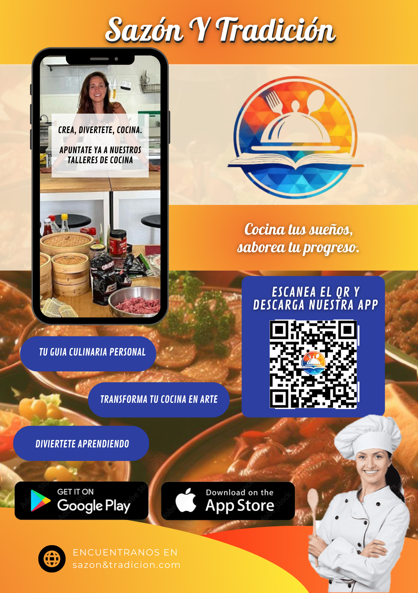

# DIU24
Prácticas Diseño Interfaces de Usuario 2023-24 (Tema: Experiencias gastronómicas ) 

Grupo: DIU2.Alcaparra.  Curso: 2023/24 
Updated: 17/03/2024

Proyecto: Web Experiencias Gastronómicas

Descripción:

Nuestro proyecto consiste en una web/aplicación sobre Experiencias gastronómicas, en concreto nuestra APP Sazón y Tradición es un proyecto destinado al servicio de talleres sobre cocina española y local, con el objetivo de ofrecer una experiencia completa a nuestros visitantes. Nuestra propuesta consiste en una web o app que permite a los usuarios registrarse y llevar un control de sus talleres realizados, sus reservas y otra información, permitimos una subscripción VIP con ciertos beneficios, y otras distintas funcionalidades. Para ello proponemos un diseño fácil de navegar y lo mas intuitivo posible, con una estructura clara y organizada dividida en secciones, para facilitar la lectura y comprensión de la información.
Logotipo: 

Miembros
 * :bust_in_silhouette:   Álvaro López Vergara     :octocat:     
 * :bust_in_silhouette:  David Ortega Sillero     :octocat:

----- 

# Proceso de Diseño 

## Paso 1. UX User & Desk Research & Analisis 

 **1.a User Reseach Plan**
-----

>>> Hemos rellenado la plantilla de User Research para poder mejorar el desarrollo de nuestra página web. Este documento recopila información, análisis de preferencias de usuarios, así como los objetivos generales que pretendemos potenciar.
>>> [User Research PDF](P1/1.UserResearch/UserResearch_Alcaparra.pdf).

 1.b Competitive Analysis
-----

>>> Hemos realizado el analisis de 3 paginas diferente, las dos que visitan nuestras personas y una tercera que pensamos que mejora en gran medida, varios de los aspectos, con respecto a las dos primeras, tanto a nivel funcional, estético, entre otro. Estos puntos son los que creemos más relevantes para una pagina web y en concreto de experiencias y aprendiaje gastronómico.
>>> 

 1.c Persona
-----

>>> Hemos seleccionado estas dos personas, un historiador y profesor de instituto de Logroño, y una ingeniera ambiental de valencia, ambos con su propio y diferente trasnfondo personal. Pensamos que los dos buscan entrar en un nuevo ambito como es la gastronomía y que debido a sus diferencias, buscaran distintas cosas dentro de este mismo objetivo.
>>> 
>>> 

 1.d User Journey Map
----

>>> Presentamos dos experiencias de usuario distintas según las caracteristicas de nuestras personas. Que aunque puedan parecer inusuales, creemos que son bastante fieles a la personalidad y espectativas ee cada uno.
>>> 
>>> 

 1.e Usability Review
----

>>> - Enlace al documento: [Usability Review PDF](P1/5.UsabilityReview/UsabilityReview.pdf).
>>> - Valoración final (numérica): 66 - Moderate
>>> - Comentario sobre la valoración: La página de Granada Cooking ha obtenido una puntuación de 66 en nuestro Usability Review. En general la web está correctamente seccionada con apartados concisos e informativos. Dispone de un menú superior que permite acceder a los apartados principales como son la sección de talleres. No obstante, se han hallado una serie de fallos críticos que empeoran la experiencia de usuario final como son:
>>> 
>>>     -- Tiempo de carga de la sección de _talleres_ extremadamente lenta.
>>> 
>>>     -- En la página principal solo se muestran talleres ya expirados, haciendo imposible su reserva.
>>> 
>>>     -- Dificultad para guardar un curso en el carrito, puede mostrar un mensaje de error extraño si no se hace correctamente.
>>> 
>>>     En conclusión la página web es minimalista y cumple con su función aunque tiene diversos apartados a mejorar.

## Paso 2. UX Design  

 2.a Reframing / IDEACION: Feedback Capture Grid / EMpathy map 
----

### 1. IDEACION (Empathy Map)
Hemos realizado un mapa de empatía, en el que recabamos el comportamiento de los usuarios de la práctica 1 (y además nuestra propia experiencia) para así abordar el diseño.

### 2. Propuesta de valor (Scope Canvas)
"Descubre la esencia auténtica de la gastronomía regional española además de los tesoros culinarios autóctonos de las distintas zonas regionales de todo el mundo con nuestra plataforma de cursos online. Explora desde los clásicos hasta los platos de nicho, ofreciendo una experiencia única que revela la diversidad de la cocina tradicional española y de las gastronomías locales de distintos países, desconocidas para muchos".

Nuestra plataforma se centra en la gastronomía española y en la cocina local de distintos lugares del mundo, es decir, no los platos típicos sino distintas experiencias poco habituales, dando valor añadido a nuestra propuesta en comparación a la competencia.

### 3. Task Analysis
Presentamos el Task Analysis en el que identificamos las tareas principales y su relevancia para los distintos usuarios que hemos identificado; no registrados, registrados y usuarios VIP. En primer lugar enumeramos las tareas en la tabla e indicando su relevancia (- nula, 1 Baja, 2 media, 3 alta). A continuación reflejamos las tres más importantes en los User Flow, que muestran de forma visual la acciones que hay que llevar a cabo para realizar una actividad/tarea, y muestra las relaciones y las dependencias entre las mismas.

#### 3.1. Task Matrix

#### 3.2. User Flow

### 4. ARQUITECTURA DE INFORMACIÓN
Proponemos una organización lógica de la navegación y elementos de diseño. En este paso, presentamos el sitemap junto con el etiquetado (labelling) del sitio:

#### 4.1. Sitemap

#### 4.2. Labelling

### 5. Prototipo Lo-FI Wireframe 
Los diseños se han realizado en tres partes. La primera ha sido una primera idea o sketch realizado a mano. La segunda es un diseño preliminar en Figma. La última es el diseño preparado para diferentes formatos de pantallas, hecho en Figama haciendo uso del plugin Breakpoints. Hemos hecho layouts para PC, tablet y móvil.

#### 5.1. Esbozos a papel

 

#### 5.2. Wireframes preliminares en Figma

#### 5.3. Diseños Responsive en Figma (usando Breakpoints)

*Ver vídeo adjunto que muestra el comportamiento responsive de los layouts:* [Video layouts responsive](P2/5_3_VideoResponsive.webm)

### 6. Conclusiones  
En esta práctica hemos analizado las desventajas que nuestras personas y nosotros mismos habíamos encontrado en las páginas web analizadas en la práctica anterior. Esto nos ha permitido obtener diversas nociones sobre los diseños que serían apropiados para nuestra página. Además hemos realizado nuestra propuesta de valor que nos permitirá aportar mayor valor a nuestra comunidad de usuarios que se verá incrementada efectivamente. Finalizamos la práctica obteniendo nuestros diseños adaptativos a distintos formatos de pantalla, hecho que es de gran utilidad teniendo en cuenta que en la actualidad gran parte de la comunidad accede a las plataformas web desde el móvil.

## Paso 3. Mi UX-Case Study (diseño)

## Moodboard (diseño visual + logotipo)  
Presentamos nuestro moodboard, en el que detallamos la guía de estilos visual de nuestra app. Dentro de la imagen se encuentran los detalles y justificación de la elección de cada componente, tanto para logo, tipografia, paleta de colores, etc.

## Landing Page
Nuestro Landing Page emplea el estilo de diseño visual seleccionado. Ya que el objetivo principal de una landing page es convertir a los espectadores del mismo en clientes potenciales o reales hemos definido su diseño en base a los siguientes puntos:
- Nombre y logo presentes, presentados al inicio y claramente distinguibles.
- Señalar claramente que es una aplicación y como obtenerla/descargarla.
- Ciertos motivos para usarla, "beneficios".
- Que quede claro el objetivo de nuestra app el tema, y para que es.

Con los puntos anteriores creemos que tenemos un landing page atrativo y claro con un mensaje directo.

## Guidelines
La información sobre los patrones de diseño se ha extraído de [Material3](https://m3.material.io/components). En el pdf que presentamos a continuación explicamos los patrones usados y aduntamos imagenes de los componentes que hemos diseñado para llevar a cabo estos. Toda la información se encuenta aqui: [Guidelines](P3/PatronesDiseñoGuidelines.pdf)

## Mockup: LAYOUT HI-FI 
Finalmente, con todo lo anterior, definimos nuestro prototipo final, en el cual aplicamos todo lo visto, con nuestro propio estilo y diseños definidos anteriormente.

Enlace a un video mostrando el prototipo en Figma, navegando por las distintas paginas y mostrando los diseños creados: [Video_HIFI](P3/Video_Layout_HIFI.mp4)

Enlace a el prototipo en Figma: [DISEÑO HI-FI
](https://www.figma.com/design/96KRfwwCpYM1H7CoXUal2D/DIU2.Alcaparra---Saz%C3%B3n-Y-Tradici%C3%B3n?node-id=54795%3A26436&t=U6ndjTxXUq5liRxb-1)

## Valoración del equipo sobre la realización de esta práctica o los problemas surgidos
En el proceso de diseño, hemos creado un prototipo de app realista utilizando Figma. Este mokup HI-FI ha sido clave para definir y perfeccionar el diseño de la aplicación, así como las transiciones entre las distintas secciones y pantallas.

Al usar los componentes de diseño y las guías de Material M3 de Google, hemos reutilizado muchos componentes, lo que nos ha facilitado el diseño y ha garantizado que la aplicación tenga un aspecto moderno y cohesivo. La implementación de estas directrices ha asegurado una experiencia de usuario intuitiva y estética, alineada con los estándares actuales de diseño de aplicaciones móviles Android.

Por otro lado, también hemos tenido ciertos problemas con Figma dado que el diseño del Flow y creación de todos los componentes de la app han llevado mucho tiempo y múltiples revisiones. No obstante, la versión final ha quedado finalmente bien conseguida.

En resumen, aunque hemos tenido dificultades, el uso de Figma y las guías de Material M3 nos ha permitido crear una aplicación con un diseño atractivo y moderno que podría tener un gran potencial de comercialización.

## Paso 5. Exportación & evaluación con Eye Tracking 

)  5.b Eye Tracking method 
Para analizar el buen diseño de la interfaz y conocer que secciones captan en mayor medida la atención, vamos a utilizar técnicas de benchmarking para evaluar el diseño de estas aplicaciones, en concreto vamos a usar Gaze Recorder, para obtener mapas de calor y ver los puntos mas criticos de los diseños. Hemos realizado esto para 2 casos, con dos objetivos diferentes, tanto para el caso A como el B, realizando una comparación directa de los resultados. 
Las dos pruebas han sido:
- Explorar el homepage
- Acceder a la información y/o descripción de un curso(B) o taller(A)
En este archivo se pueden consultar los resultados recogidos: [Eye Tracking](P4/3_Eye_Tracking.pdf)

## Paso 4. Evaluación 

 4.a Caso asignado
El proyecto que nos ha tocado co-evaluar es el del equipo **DIU3_13 TecladoyRatón** cuyo enlace a Github es el siguiente: [Grupo_Caso_B](https://github.com/bete2043/DIU)

Su proyecto es llamado *Foto Élite* y consiste en una aplicación de un club de fotografía en el que se imparten cursos y conocimientos sobre el mundo de la fotografía y permite a las personas poder conocer más sobre este campo. Su diseño HI-FI o mockup de su aplicación se puede hallar en el siguiente enlace a Figma: [Mockup_Caso_B](https://www.figma.com/design/dLHjxgrZM3L5WOI7Do9CoY/Guidelines-%26-Layout?node-id=77%3A830&t=JlTJYw2a5UhbiYQ6-1)

Vamos a analizar la usabilidad del prototipo empleando una combinación de dos técnicas: la prueba A/B y el cuestionario SUS (System Usability Scale). Esto permitirá comparar el rendimiento de dos alternativas de diseño.

A continuación procedemos con su co-evaluación mediante la aplicación de distintos test y simulación de tareas en la aplicación para comprobar el índice de satisfacción general de los usuarios con la app.

 4.b User Testing
Para evaluar la usabilidad hemos escogido 4 personas ficticias con características y personalidades distintas:
* Una mujer de 34 años con experiencia intermedia en internet.
* Un chico de 15 años con experiencia intermedia.
* Un hombre de 46 años con baja experiencia.
* Una mujer de 27 años muy experimentada en las tecnologías.

Las 2 primeras personas han evaluado el caso A, mientras las otras dos el caso B. Para proceder con la evaluación hemos pedido ayuda a conocidos con experiencia similiar a los usuarios ficticios para que puedieran aportarnos su feedback y ayudarnos a completar el cuestionario SUS de manera más realista para evitar sesgar los resultados. A continuación, recogemos en una tabla los usuarios ficticios escogidos para esta tarea:

 4.c Cuestionario SUS
----
Para cada uno de los personajes ficticios que hemos creado, hemos completado el cuestionario SUS (*System UsabilitY Scale*). Este test lo hemos realizado con la ayuda de conocidos que han desempeñado el papel de los usuarios. Cada uno de ellos tenía una experiencia similar a la descrita para cada personaje pora dotar a los resultados de una mayor fiabilidad. Abajo se muestran los resultados de cada usuario, recogidos en una tabla de Excel:

Hemos realizado el Cuestionario SUS para valorar la satisfacción de cada usuario con el diseño.
Las conclusiones que podemos sacar a partir de este cuestionario para cada caso son:

* **Cuestionario Caso A (Grupo Alcaparra)**
La media de puntuación de los dos usuarios (#01 y #02) es de 78,75. Esto indica una buena usabilidad, situándose por encima del promedio. Esto sugiere que la mayoría de los usuarios encuentran la aplicación fácil de usar y tienen una experiencia positiva. La puntuación está cerca del rango de excelencia, aunque aún hay margen para mejoras. Los usuarios probablemente recomienden la aplicación, pero sería beneficioso abordar pequeñas áreas de frustración para perfeccionar la experiencia. 

* **Cuestionario Caso B (Grupo Teclado y Ratón)**
Para el caso B los resultados han sido 62.5 y 72.5, lo cual es una calificación mediocre, de grado C, indicando que la aplicación es simplemente aceptable. La puntuación se encuentra en el rango medio, sugiriendo que la mayoría de los usuarios pueden utilizarla sin muchos problemas, aunque existen áreas que requieren mejoras. Algunas tareas son tediosas o imposibles de realizar debido a la falta de implementación, como un área de descripción detallada de los cursos de fotografía disponibles.

Con esta puntuación, los usuarios probablemente continuarán usando la aplicación, pero tienen ciertas quejas que los impiden estar completamente satisfechos. Es poco probable que recomienden la aplicación a otros debido a sus defectos. Se recomienda atender las sugerencias de los usuarios y realizar encuestas sobre la funcionalidad de la aplicación para seguir mejorándola.

 4.d Usability Report
----
En este informe detallamos el análisis completo de la usabilidad de la aplicación B, *Foto Élite*. El archivo se puede consultar aquí: [Usability Report](P4/5_Usability_Report_B.pdf)

Resumidamente, la aplicación presenta una serie de problemas que perjudican la experiencia de usuario como son los siguientes:

- **Apartado de configuración inexistente:** La aplicación no dispone de una sección de ajustes en la que podamos establecer la configuración básica de la aplicación. Este apartado sería útil dado que podría servir para cmabiar parámetros como el idioma de la app, ajustes de accesibilidad (como por ejemplo aumentar el tamaño de fuente) y por último se podrían gestionar las notificaciones para poder recordar al usuario de próximos cursos reservados.

- **Falta de sección de carrito de compra:** Aunque el carrito de la compra está implementado, solo se puede acceder al pulsar el botón de comprar en la sección de "Galeria". Sería de utilidad crear un botón específico para acceder a esta sección más fácilmente para mejorar la experiencia.

- **Formulario de reserva de un curso:** Los campos son algo confusos y pueden ser irrelevantes a la hora de realizar una reserva, por ejemplo, la dirección; podrían omitirse o autocompletarse de forma transparente al usuario, adquiriendo esta información del perfil del usuario y no cada vez que se realiza una reserva.

- **Accesibilidad del calendario:** No existe un acceso a un apartado de calendario en el que se visualicen de forma rápida y fácil los días en los que se realizarán los cursos. Para conocer los días en que se imparte cada curso hay que iniciar el proceso de reserva de cada curso, lo que es bastante tedioso. Como solución, podría ponerse un apartado en la barra de navegación o un subapartado dentro de la sección de cursos.

- **Información de un curso nula:** No existe un apartado en el que se detalle la información relativa a un curso en concreto. Esto es vital para los usuarios, pues muchos no realizarán reservas si no saben de qué trata el curso, qué actividades en concreto van a realizar, quién lo imparte, hora, lugar, precio, etc. Proponemos que antes del proceso de reserva, se muestra una pantalla de descripción del curso, con toda la información necesaria y de interés.

### Valoración personal 
A esar de los errores presentados anteriormente, pensamos que Foto Élite, es una gran aplicación que cumple con practicamente todas las cosas que se esperan de una aplicación de cursos de fotografía, que tiene mucho potencial y margen de mejora. Creemos firmemente que, solventando los problemas vistos, Foto Élite puede ser una aplicación destacable en su sector. Destacar tambien su diseño claro, sencillo y minimalista;  y el atractivo logo, muy acorde con la temática.

5.) Conclusion de EVALUACION (A/B testing + usability report + eye tracking) 
En conclusión, en la prueba del A/B testing, nuestro Caso A (*Sazón y Tradición*), con una puntuación SUS de 78.75, demuestra buena usabilidad, mientras que el Caso B (*Foto Élite*), con 67.5, indica una experiencia aceptable pero mejorable. Los problemas principales del caso B incluyen un formulario de reserva confuso, dificultad para acceder al calendario y falta de información detallada sobre los cursos. Recomendamos simplificar el formulario, añadir un acceso directo al calendario y proporcionar descripciones completas de los cursos antes de la reserva. Estas mejoras, basadas en el feedback de usuarios ficticios y pruebas de Eye Tracking, facilitarán la navegación y mejorarán la satisfacción del usuario. Implementar pruebas de usabilidad continuas y encuestas ayudará a mantener y mejorar la calidad de la aplicación. 

## Conclusión final / Valoración de las prácticas
De forma general y resummida, pensamos que las prácticas desarrolladas en la asignatura nos han hecho ver la experiencia de usuario, la accesibilidad y el diseño de las interfaces en general, de otra manera; cosa que vemos ahora como un punto mucho mas relevante del que creiamos, habiendo aprendido a mejorar nuestros diseños, hacerlos mas accesibles a todos los usuarios. Pensamos que gracias a estas prácticas hemos aprendido conceptos, y técnicas que nos serán útiles en nuestras futuras páginas y aplicaciones.

